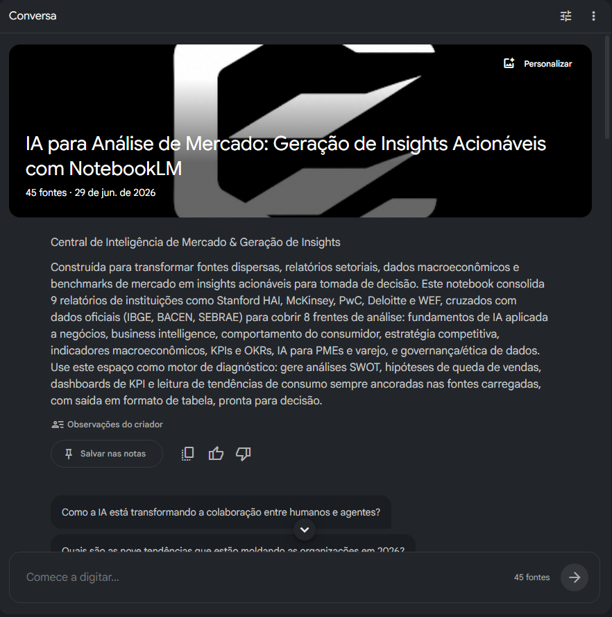

<p align="center">
  
</p>

<p align="center">
  <a href="https://notebooklm.google.com/notebook/9a309eff-4994-4f23-8ba4-69947d243893">
    
  </a>
  
  
  
</p>

<h1 align="center">🧠 IA para Análise de Mercado</h1>
<h3 align="center">Geração de Insights Acionáveis com NotebookLM</h3>

<p align="center">
  Projeto desenvolvido para o Desafio de Projeto da <strong>DIO</strong><br/>
  <em>IA como ferramenta de aprendizagem ativa · Curadoria de fontes · Engenharia de Prompts</em>
</p>

---

## 📑 Índice

- [1. Contexto e Objetivos](#1-contexto-e-objetivos)
- [2. Arquitetura do Conhecimento](#2-arquitetura-do-conhecimento)
- [3. Curadoria de Fontes](#3-curadoria-de-fontes)
- [4. Engenharia de Prompts e Cicatrizes](#4-engenharia-de-prompts-e-cicatrizes)
- [5. Miniguia de Estudo](#5-miniguia-de-estudo)
- [6. Glossário](#6-glossário)
- [7. Prompts Reutilizáveis](#7-prompts-reutilizáveis)
- [8. Aprendizados e Próximos Passos](#8-aprendizados-e-próximos-passos)
- [9. Referências](#9-referências)

---

## 1. Contexto e Objetivos

Empresas de todos os portes tomam decisões diárias sobre estoque, preços, campanhas e expansão. Na maioria dos casos, essas decisões se baseiam em intuição ou dados fragmentados — sem uma análise que conecte informações internas (vendas, custos, margens) com inteligência de mercado externa (tendências, concorrência, indicadores econômicos).

Este projeto constrói um **Caderno Temático no Google NotebookLM** focado em **IA aplicada à análise de mercado**. A base de conhecimento curada funciona como um sistema de inteligência capaz de:

- Identificar tendências de consumo e padrões emergentes
- Conduzir análise competitiva (SWOT, benchmarking, Porter)
- Segmentar mercados por comportamento, região e perfil
- Mapear riscos macroeconômicos e regulatórios
- Gerar hipóteses testáveis para decisões de negócio
- Transformar dados em recomendações com KPIs de acompanhamento

**Objetivos de estudo:**

1. Dominar fundamentos de IA aplicada a Business Intelligence
2. Desenvolver competência em curadoria e avaliação crítica de fontes
3. Praticar Engenharia de Prompts para extração de insights
4. Construir um framework reutilizável de análise de mercado
5. Documentar o processo de aprendizagem — incluindo erros e iterações

### 🖥️ Demonstração do Workspace

<p align="center">
  
</p>

---

## 2. Arquitetura do Conhecimento

O conhecimento foi organizado em 8 categorias que, juntas, cobrem todas as dimensões de uma análise de mercado:

```
┌─────────────────────────────────────────────────────────────────┐
│                  🧠 AI MARKET INTELLIGENCE PLAYBOOK             │
├─────────────────────────────────────────────────────────────────┤
│                                                                 │
│  ┌──────────────────┐  ┌──────────────────┐  ┌───────────────┐ │
│  │ 1. Fundamentos   │  │ 2. Analytics &   │  │ 3. Comporta-  │ │
│  │ de IA p/ Negócios│──│ Business Intel.  │──│ mento do      │ │
│  │                  │  │                  │  │ Consumidor    │ │
│  └────────┬─────────┘  └────────┬─────────┘  └──────┬────────┘ │
│  ┌────────▼─────────┐  ┌───────▼──────────┐  ┌──────▼────────┐ │
│  │ 4. Estratégia &  │  │ 5. Dados Macro-  │  │ 6. Métricas,  │ │
│  │ Competitividade  │──│ econômicos       │──│ KPIs & OKRs   │ │
│  └────────┬─────────┘  └────────┬─────────┘  └──────┬────────┘ │
│  ┌────────▼─────────┐  ┌───────▼──────────┐                    │
│  │ 7. IA para PMEs  │  │ 8. Ética, Gov.   │                    │
│  │ E-comm & Varejo  │──│ & Regulação      │                    │
│  └──────────────────┘  └──────────────────┘                    │
└─────────────────────────────────────────────────────────────────┘
```

| # | Categoria | Cobertura |
|---|---|---|
| 1 | **Fundamentos de IA** | ML, Deep Learning, NLP, GenAI, Agentic AI, AutoML |
| 2 | **Analytics & BI** | Dashboards, pipelines, self-service BI, Looker, Power BI |
| 3 | **Comportamento do Consumidor** | Tendências, jornada do cliente, segmentação, social listening |
| 4 | **Estratégia & Competitividade** | SWOT, benchmarking, Porter, Blue Ocean |
| 5 | **Dados Macroeconômicos** | PIB, inflação, emprego, indicadores setoriais e regionais |
| 6 | **Métricas, KPIs & OKRs** | CAC, LTV, ROI, ROAS, churn, NPS, ticket médio, giro de estoque |
| 7 | **IA para PMEs & Varejo** | Automação acessível, marketplace analytics, pricing dinâmico |
| 8 | **Ética & Regulação** | LGPD, AI Act, viés algorítmico, IA responsável |

---

## 3. Curadoria de Fontes

### 3.1 Fontes primárias — PDFs carregados no NotebookLM

9 relatórios selecionados de instituições de alta credibilidade. Critério: 2026 prioritário, 2025 como complemento consolidado.

#### 📄 PDFs 2026

| # | Arquivo | Instituição | Relevância |
|---|---|---|---|
| 1 | `ai_index_report_2026.pdf` | Stanford HAI | Referência acadêmica global. Investimento, modelos, impacto econômico, tendências por país. |
| 2 | `the-state-of-organizations-2026.pdf` | McKinsey / QuantumBlack | 88% usam IA, 81% sem resultado. Agentic AI, AI Trust, gap adoção vs. valor. |
| 3 | `2026 AI Business Predictions_PwC.pdf` | PwC | 74% do valor da IA capturado por 20% das empresas. ROI, reinvenção de modelos. |
| 4 | `DI_Tech-trends-2026.pdf` | Deloitte Insights | IA física, infraestrutura híbrida, cibersegurança, Great Rebuild — org. AI-native. |
| 5 | `WEF_Top_10_Emerging_Technologies_Report_2026.pdf` | World Economic Forum | 10 tecnologias emergentes que vão remodelar negócios e sociedade em 2026+. |
| 6 | `ai-governance-principles-for-boards-report.pdf` | — | Princípios de governança de IA para conselhos e lideranças. Ética e compliance. |
| 7 | `Responsible AI_ Overcoming adoption barriers and risks.pdf` | — | Barreiras reais de adoção de IA e como superá-las com responsabilidade. |

#### 📄 PDFs 2025 (referências consolidadas)

| # | Arquivo | Instituição | Relevância |
|---|---|---|---|
| 8 | `WEF_Future_of_Jobs_Report_2025.pdf` | World Economic Forum | +170M empregos, −92M deslocados. Top 10 skills. Projeções até 2030. |
| 9 | `the-state-of-ai-in-2025-vf.pdf` | McKinsey / QuantumBlack | Survey com ~1.800 respondentes. Benchmark de adoção, ROI e maturidade. |


---

### 3.2 Fontes complementares por categoria

**IA & Tecnologia** — [Google AI Research](https://ai.google/research/) · [Microsoft AI](https://www.microsoft.com/en-us/ai) · [IBM Think](https://www.ibm.com/think) · [OpenAI Research](https://openai.com/research) · [DeepMind](https://deepmind.google/research/) · [ArXiv cs.AI](https://arxiv.org/list/cs.AI/recent)

**Analytics & BI** — [MIT Sloan Management Review](https://sloanreview.mit.edu/) · [Google Cloud Resources](https://cloud.google.com/resources) · [AWS ML Blog](https://aws.amazon.com/blogs/machine-learning/) · [Gartner Articles](https://www.gartner.com/en/articles)

**Consumidor** — [NielsenIQ Insights](https://nielseniq.com/global/en/insights/) · [Euromonitor](https://www.euromonitor.com/insights) · [Think with Google](https://www.thinkwithgoogle.com/) · [Google Trends](https://trends.google.com/) · [Statista](https://www.statista.com/)

**Estratégia** — [McKinsey Insights](https://www.mckinsey.com/featured-insights) · [BCG Henderson Institute](https://www.bcg.com/henderson-institute) · [Bain Insights](https://www.bain.com/insights/) · [HBR](https://hbr.org/) · [Deloitte Insights](https://www2.deloitte.com/insights) · [PwC Strategy+](https://www.strategyand.pwc.com/)

**Macroeconomia** — [World Bank Data](https://data.worldbank.org/) · [OECD Data](https://data.oecd.org/) · [IMF Data](https://www.imf.org/en/Data) · [Our World in Data](https://ourworldindata.org/)

**Brasil** — [IBGE](https://www.ibge.gov.br/) · [IPEA Data](http://www.ipeadata.gov.br/) · [BACEN SGS](https://www.bcb.gov.br/estatisticas) · [FGV IBRE](https://portalibre.fgv.br/) · [SEBRAE Estudos](https://sebrae.com.br/sites/PortalSebrae/estudos-e-pesquisas) · [Dados.gov.br](https://dados.gov.br/)

**Métricas** — [What Matters (OKRs)](https://www.whatmatters.com/) · [KPI Institute](https://kpiinstitute.org/) · [Google Analytics Academy](https://analytics.google.com/analytics/academy/)

**Ética & Regulação** — [EU AI Act](https://artificialintelligenceact.eu/) · [Google Responsible AI](https://ai.google/responsibility/) · [OECD AI](https://oecd.ai/) · [LGPD](http://www.planalto.gov.br/ccivil_03/_ato2015-2018/2018/lei/l13709.htm)

---

## 4. Engenharia de Prompts e Cicatrizes

### 4.1 Framework C.R.I.A.

Para estruturar prompts no NotebookLM, desenvolvi o framework **C.R.I.A.**:

```
C — CONTEXTO    Setor, porte, região, momento do negócio
R — ROL         Papel da IA (analista, consultor, auditor)
I — INSTRUÇÃO   Ação específica (comparar, listar, recomendar)
A — AÇÃO        Formato de saída (tabela, SWOT, dashboard)
```

### 4.2 Evolução dos prompts

| Versão | Prompt | Resultado |
|---|---|---|
| v1 ❌ | *"Me fale sobre análise de mercado"* | Genérico, superficial, sem dados. |
| v2 ⚠️ | *"Quais KPIs são importantes para varejo?"* | Melhor, mas sem contexto de porte ou objetivo. |
| v3 ✅ | *"Atuando como analista de dados de uma rede varejista de médio porte com 15 lojas no Sudeste, quais KPIs monitorar diariamente para detectar queda de vendas? Organize como dashboard: KPI, meta, frequência, alerta."* | Específico, contextualizado, formato definido. |
| v4 🎯 | *"Com base nas fontes deste notebook (NielsenIQ, Euromonitor), compare tendências de consumo 2024 vs 2025 e identifique 3 oportunidades para uma loja de cosméticos em cidade de 200 mil hab. Para cada uma: ação prática + KPI."* | Referencia fontes, contexto preciso, entrega acionável. |

### 4.3 Perguntas estratégicas por categoria

**IA para Negócios**
```
→ "Qual o nível de maturidade em IA das empresas brasileiras comparado à média global?"
→ "Compare IA Generativa vs ML clássico para análise de mercado. Quando usar cada um?"
→ "Que ferramentas de IA gratuitas posso usar para análise de vendas? Compare 4 opções."
```

**Analytics & BI**
```
→ "Crie um framework de Data-Driven Decision Making para uma empresa que nunca usou dados."
→ "Por que as vendas podem subir em volume mas o faturamento cair? Liste causas e como investigar."
→ "Queda de 15% no ticket médio em 3 meses. Quais hipóteses testar? Monte árvore de diagnóstico."
```

**Comportamento do Consumidor**
```
→ "Quais as 5 principais mudanças no comportamento do consumidor entre 2024 e 2025?"
→ "Compare RFM, análise de coorte e clusterização K-Means. Quando usar cada modelo?"
→ "Como usar Google Trends para identificar tendências antes que virem mainstream?"
```

**Estratégia & Competitividade**
```
→ "Monte análise SWOT para e-commerce de moda no Brasil em 2025 usando dados deste notebook."
→ "Aplique 5 Forças de Porter para o setor de [X]. Qual a maior ameaça e 3 ações para mitigá-la?"
→ "Como fazer benchmarking de concorrentes usando apenas dados públicos gratuitos?"
```

**Métricas & KPIs**
```
→ "Crie dashboard de KPIs para e-commerce: KPI, fórmula, meta, frequência, ação quando fora da meta."
→ "Diferença entre KPI e métrica de vaidade? Dê 5 exemplos de cada."
→ "Qual produto eu NÃO deveria mais vender? Que análise responde isso? (margem, giro, ABC)"
```

**PMEs & Varejo**
```
→ "Sou dono de loja física em cidade de 100 mil hab. Como usar IA com orçamento zero?"
→ "Compare loja física vs e-commerce vs marketplace: métricas comuns e exclusivas."
→ "Que oportunidades a IA cria para MEIs no Brasil? Use dados do SEBRAE."
```

**Ética & Governança**
```
→ "O que a LGPD permite e proíbe para uso de dados de clientes em analytics e IA?"
→ "Compare EU AI Act com a regulação brasileira (PL 2.338/2023). Diferenças e impactos?"
```

### 4.4 Troubleshooting — Cicatrizes

Registro dos problemas encontrados e como foram resolvidos:

| Problema | Causa | Solução | Lição |
|---|---|---|---|
| Respostas vagas | Prompts sem contexto (setor, porte) | Framework C.R.I.A. | IA não lê mentes. Contexto é tudo. |
| IA inventou estatísticas | Perguntei sobre dados fora das fontes | Sempre referenciar: *"Com base nas fontes deste notebook..."* | Sem âncora nas fontes, o modelo alucina. |
| Respostas longas sem foco | Perguntas abertas tipo "me fale sobre..." | Definir formato: *"Organize em tabela X, Y, Z"* | Tabelas e listas forçam objetividade. |
| Não cruzou fontes | Fontes tratadas isoladamente | Pedir cruzamento explícito entre fontes | O valor do NotebookLM está na síntese entre fontes. |
| Respostas em inglês | Fontes majoritariamente em inglês | Adicionar *"Responda em português do Brasil"* | Sempre especificar idioma de saída. |
| SWOT superficial | Pedido sem dados de entrada | Incluir cenário: porte, setor, região, dados | Frameworks estratégicos precisam de inputs concretos. |
| KPIs irrelevantes | Sem especificação do modelo de negócio | Contextualizar: *"e-commerce B2C, ticket médio R$350"* | KPIs são específicos do modelo. Não existe lista universal. |

---

## 5. Miniguia de Estudo

### 5.1 IA nos Negócios — Estado Atual (2026)

**Panorama global (2026):**
- 88% das organizações usam IA, mas 81% sem impacto mensurável no resultado (McKinsey, 2026)
- 74% do valor econômico da IA é capturado por apenas 20% das empresas (PwC, 2026)
- 88% das empresas já embarcam AI Agents nos workflows (KPMG/EY, 2026)
- 53% reportam falta de talentos para executar planos de transformação com IA

**O que separa as empresas que obtêm resultado:**
- Redesenham operações para serem AI-native (não apenas adicionam IA sobre processos antigos)
- Usam IA como motor de reinvenção (novos modelos de receita), não só eficiência
- Investem em governança e AI Trust como pré-requisito para escalar

**Cenário Brasil (IBGE/PINTEC, SEBRAE, FGV):**
- Uso de IA na indústria: de 16,9% (2022) para 41,9% (2024)
- 67% das empresas consideram IA entre as 5 maiores prioridades
- Áreas de aplicação: Administração (87,9%), Comercialização (75,2%), P&D (73,1%)
- Desafios: analfabetismo digital, regulação (PL 2.338/2023), escassez de talentos (39%)

> A oportunidade está em ser o profissional que conecta IA aos problemas reais do negócio — não em usar a tecnologia por si só.

### 5.2 Data-Driven Decision Making — Armadilhas

Os 5 erros mais comuns segundo Harvard (Luca & Edmondson):

| Armadilha | Exemplo | Como evitar |
|---|---|---|
| Confundir correlação com causalidade | "A campanha causou o aumento de vendas" | Testes A/B, controle de variáveis |
| Superestimar o efeito | "IA aumenta vendas em 30% — vai aumentar as nossas" | Contextualizar por porte, setor, maturidade |
| Medir o fácil, não o importante | "Medimos likes, não conversão" | KPIs derivados do objetivo de negócio |
| Generalizar de outros contextos | "Funcionou no Magazine Luiza" | Validar com dados próprios |
| Peso excessivo a um resultado | "A McKinsey disse X" | Triangular com múltiplas fontes |

> Dados não tomam decisões. Pessoas treinadas tomam decisões usando dados. O diferencial é governança, pensamento crítico e processo.

### 5.3 Skills Mais Demandadas (WEF 2025-2030)

Projeção: +170M de novos empregos, −92M deslocados, **saldo: +78M**.

| # | Skill | Tipo |
|---|---|---|
| 1 | Pensamento analítico | 🧠 Cognitiva |
| 2 | Resiliência e agilidade | 🧠 Soft skill |
| 3 | Liderança e influência social | 🤝 Interpessoal |
| 4 | Pensamento criativo | 🧠 Cognitiva |
| 5 | Motivação e autoconhecimento | 🧠 Soft skill |
| 6 | **AI e Big Data** | 💻 Técnica |
| 7 | **Literacia tecnológica** | 💻 Técnica |
| 8 | Curiosidade e aprendizado contínuo | 🧠 Cognitiva |
| 9 | Design e UX | 💻 Técnica |
| 10 | Empatia e escuta ativa | 🤝 Interpessoal |

6 das 10 são habilidades humanas. O mercado busca profissionais que saibam usar IA **e** que saibam pensar criticamente e comunicar insights.

### 5.4 KPIs que Todo Analista Deve Conhecer

| KPI | Fórmula | O que revela |
|---|---|---|
| Receita Bruta | Soma de vendas | Volume do negócio |
| Margem Bruta | (Receita − CMV) / Receita × 100 | Eficiência operacional |
| Ticket Médio | Receita / Nº de Transações | Valor médio por compra |
| CAC | Investimento Mkt / Novos Clientes | Custo de aquisição |
| LTV | Ticket × Frequência × Retenção | Valor do cliente no tempo |
| LTV:CAC | LTV / CAC (ideal > 3:1) | Sustentabilidade do crescimento |
| Churn Rate | Clientes perdidos / Base × 100 | Saúde da retenção |
| NPS | % Promotores − % Detratores | Satisfação e lealdade |
| ROAS | Receita campanha / Custo campanha | Retorno de investimento em ads |
| Giro de Estoque | CMV / Estoque Médio | Eficiência de estoque |

**Métricas de e-commerce:**

| KPI | Fórmula | Referência |
|---|---|---|
| Taxa de conversão | Compras / Visitantes × 100 | 1-3% |
| Abandono de carrinho | Abandonados / Criados × 100 | < 70% |
| Taxa de recompra | Recorrentes / Total × 100 | > 20% |

### 5.5 IA para Pequenos Negócios — Aplicações Práticas

Cenário Brasil (SEBRAE/FGV): 98% dos empreendedores têm acesso à internet, 71% consideram análise de dados importante, mas o analfabetismo digital funcional ainda é barreira.

| Aplicação | Ferramenta | Custo |
|---|---|---|
| Análise de vendas | Google Sheets + Gemini | Gratuito |
| Conteúdo de marketing | ChatGPT / Gemini / Claude | Gratuito (free tier) |
| Dashboard de vendas | Looker Studio | Gratuito |
| Pesquisa de mercado | Google Trends + NotebookLM | Gratuito |
| Precificação | Planilha com análise de margem | Gratuito |
| Previsão de demanda | Google Sheets + média móvel | Gratuito |

---

## 6. Glossário

| Termo | Definição |
|---|---|
| **AI Agent** | Sistema de IA que executa tarefas de múltiplas etapas de forma autônoma |
| **Análise SWOT** | Framework: Strengths, Weaknesses, Opportunities, Threats |
| **Benchmarking** | Comparação de métricas ou práticas com referências do setor |
| **Business Intelligence** | Estratégias e tecnologias para transformar dados em informação acionável |
| **CAC** | Custo de Aquisição de Cliente: investimento em mkt / novos clientes |
| **Churn Rate** | % de clientes perdidos em um período |
| **Clusterização** | Agrupamento automático de dados similares (ex: K-Means) |
| **Correlação vs Causalidade** | Correlação ≠ causa. Ocorrência conjunta não implica relação causal |
| **Dashboard** | Painel visual que consolida KPIs em tempo real |
| **Data-Driven Decision Making** | Decisões baseadas em dados e análises, não em intuição |
| **ETL** | Extract, Transform, Load — pipeline de processamento de dados |
| **Five Forces (Porter)** | Análise de 5 forças competitivas de um setor |
| **IA Generativa** | IA que gera conteúdo (texto, imagem, código) a partir de prompts |
| **Insight Acionável** | Descoberta analítica que leva a uma ação de negócio concreta |
| **KPI** | Indicador-chave de desempenho vinculado a um objetivo |
| **LGPD** | Lei Geral de Proteção de Dados (Lei 13.709/2018) |
| **LTV** | Valor total que um cliente gera ao longo do relacionamento |
| **Machine Learning** | Algoritmos que aprendem padrões a partir de dados |
| **Métrica de Vaidade** | Números impressionantes que não indicam saúde real do negócio |
| **NPS** | Net Promoter Score: % promotores − % detratores |
| **OKR** | Objectives & Key Results — framework de metas (Google, Intel) |
| **Pipeline de Dados** | Coleta → Limpeza → Transformação → Armazenamento → Visualização |
| **RFM** | Segmentação por Recency, Frequency, Monetary |
| **ROAS** | Receita de campanha / Custo da campanha |
| **Série Temporal** | Dados ordenados no tempo — base para previsão de demanda |
| **Ticket Médio** | Receita / Nº de transações |

---

## 7. Prompts Reutilizáveis

Templates prontos para adaptar a qualquer empresa, setor ou cenário.

### Diagnóstico de Negócio

```
Atue como consultor de business analytics. Cenário:
- Empresa: [tipo] | Setor: [setor] | Porte: [porte]
- Região: [local] | Faturamento: [valor]
- Problema: [descreva] | Dados disponíveis: [liste]

Com base nas fontes deste notebook:
1. Diagnóstico: 5 hipóteses para o problema
2. Para cada: qual dado analisar
3. 3 ações imediatas (quick wins)
4. 3 ações de médio prazo (30-90 dias)
5. KPIs de acompanhamento

Formate como tabela. Responda em português do Brasil.
```

### Análise SWOT

```
Análise SWOT para:
- Empresa: [negócio] | Mercado: [setor e região]
- Contexto: [momento atual]

Para cada quadrante: 5 itens, impacto (Alto/Médio/Baixo), ação estratégica.
Síntese final: maior risco, maior oportunidade, prioridade #1.

Use dados das fontes deste notebook. Responda em português do Brasil.
```

### Investigação de Queda de Vendas

```
Vendas da empresa [setor] caíram [X%] no período [período].

1. 10 hipóteses (fatores internos e externos)
2. Dados necessários para testar cada uma
3. Árvore de diagnóstico
4. Benchmarks de referência
5. Ação corretiva + KPI para cada causa

Responda em português do Brasil.
```

### Gerador de Hipóteses

```
Atue como cientista de dados em time de growth.
- Negócio: [tipo] | Objetivo: [meta]
- Dados: [disponíveis] | Restrições: [orçamento, equipe, tempo]

Gere 5 hipóteses testáveis: "Se fizermos X, esperamos Y, medido por Z"
Para cada: métrica, método de teste, duração, critério de sucesso, risco.
Priorize por impacto × facilidade. Responda em português do Brasil.
```

---

## 8. Aprendizados e Próximos Passos

### O que ficou deste projeto

1. **IA é ferramenta, não solução.** O valor está na pergunta certa, não na tecnologia.
2. **Fontes importam mais que respostas.** A qualidade do output depende da qualidade das fontes. Curadoria é uma habilidade subestimada.
3. **O gap é de implementação, não de tecnologia.** 89% usam IA, menos de 1% com maturidade. A oportunidade está em fazer a ponte entre IA e resultado de negócio.
4. **Pensamento crítico protege contra viés.** Incluir fontes que questionam o próprio uso de dados é sinal de maturidade, não de fraqueza.
5. **Documentar o processo vale tanto quanto o resultado.** Os erros de prompting e as iterações são prova de aprendizado real.

### Próximos passos

- [ ] Expandir o NotebookLM com fontes setoriais (varejo, saúde, agro)
- [ ] Criar dashboards no Looker Studio com dados reais
- [ ] Implementar análise RFM em Python/Power BI
- [ ] Construir projeto de previsão de demanda com séries temporais
- [ ] Publicar artigos no LinkedIn sobre insights gerados

---

## 9. Referências

**Relatórios 2026**

1. Stanford HAI — [AI Index Report 2026](https://hai.stanford.edu/research/ai-index-report)
2. McKinsey / QuantumBlack — [State of Organizations 2026 · AI Trust 2026](https://www.mckinsey.com/capabilities/quantumblack/our-insights)
3. Google Cloud — [AI Agent Trends 2026](https://cloud.google.com/resources)
4. Deloitte — [Tech Trends 2026](https://www2.deloitte.com/insights)
5. WEF + PwC — [AI and the Future of Entry-Level Work (2026)](https://www.weforum.org/publications/)

**Relatórios 2025**

6. World Economic Forum — [Future of Jobs Report 2025](https://www.weforum.org/publications/the-future-of-jobs-report-2025/)
7. McKinsey — [The State of AI in 2025](https://www.mckinsey.com/capabilities/quantumblack/our-insights/the-state-of-ai)
8. PwC — [2025 AI Business Predictions](https://www.pwc.com/)
9. KPMG — [Trust, Attitudes and Use of AI 2025](https://kpmg.com/)
10. Luca & Edmondson, HBS — [Where Data-Driven Decision-Making Can Go Wrong](https://www.hbs.edu/faculty/)

**Fontes brasileiras**

11. IBGE — [PINTEC Semestral](https://www.ibge.gov.br/)
12. SEBRAE — [Inteligência de Mercado](https://sebrae.com.br/)
13. FGV IBRE — [Sondagens Conjunturais](https://portalibre.fgv.br/)
14. IPEA — [Pesquisa Econômica Aplicada](http://www.ipeadata.gov.br/)
15. BACEN — [Estatísticas](https://www.bcb.gov.br/estatisticas)

**Frameworks**

16. Doerr — *Measure What Matters: OKRs*. Portfolio/Penguin, 2018.
17. Croll & Yoskovitz — *Lean Analytics*. O'Reilly, 2013.
18. Porter — *Competitive Strategy*. Free Press, 1980.

**Dados abertos**

19. [World Bank Data](https://data.worldbank.org/) · [OECD Data](https://data.oecd.org/) · [IMF Data](https://www.imf.org/) · [Our World in Data](https://ourworldindata.org/) · [Google Trends](https://trends.google.com/) · [Kaggle](https://www.kaggle.com/datasets) · [Dados.gov.br](https://dados.gov.br/)

---

<p align="center">
  <strong>Desenvolvido por Ezequiel</strong><br/>
  <em>Desafio de Projeto — DIO | 2026</em>
</p>

<p align="center">
  <a href="https://notebooklm.google.com/notebook/9a309eff-4994-4f23-8ba4-69947d243893">
    
  </a>
  <a href="https://www.linkedin.com/in/ezequielgomesrocha/">
    
  </a>
  <a href="mailto:ezequiel.gomes@Live.com">
    
  </a>
</p>
